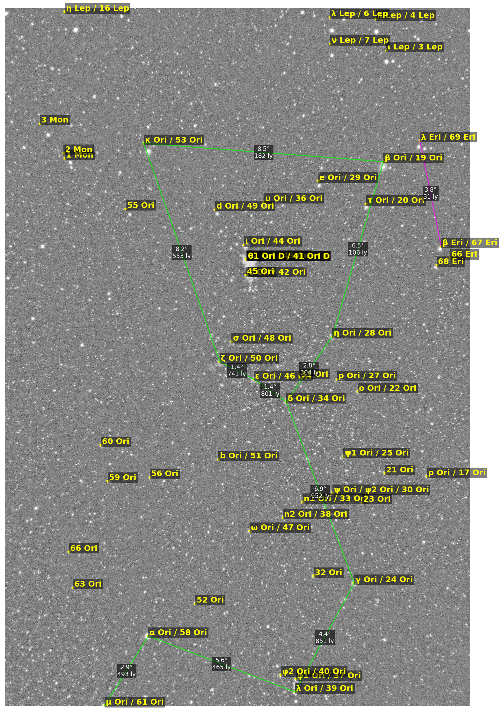

## Code to star tracker data analysis

Run scripts
- main.py to visualise star pixel ratio. Modify for loop range for your own case
- refined_star_detection.py to generate your input image
- client.py to fetch data for star pattern in your picture
- annotate_fits.py to generate output image

check config.py comments for API guidance

# Example output

Can make futher improvements in constellation_data.py as per needs

